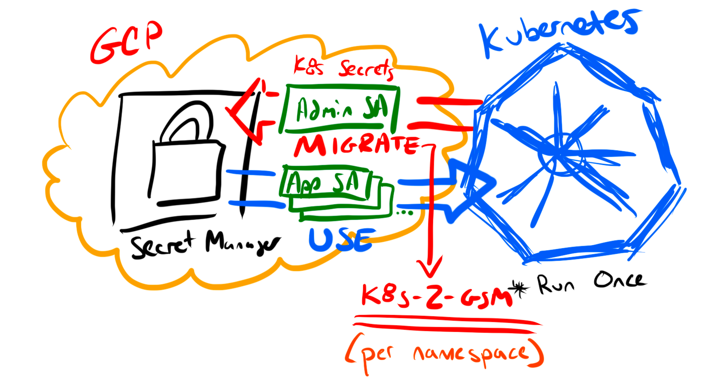

`k8s-2-gsm` is a containerized script that leverages the Google and Kubernetes API client to migrate Kubernetes secrets to Google Secret Manager.



`k8s-2-gsm` runs once per namespace (the traditional security boundary per Kubernetes secret / tenant). `Admin SA` is a GCP service account with permissions to create/manage secrets in a GCP project. The `App SA` isn't used/created by `k8s-2-gsm`, but outlines how a single `App SA` would be created for each workload to access the secrets (less permissive).

The script dumps out non-sensitive data that can be imported to your tooling of choice to manage post-migration configuration.

## Known limitations / security considerations

- Google Secret Manager is a key/value store, meaning only one secret per object.
  - Example: If you had 1 Kubernetes secret with 2 objects (tls.crt / tls.key), you now need 2 Google Secret Manager secrets (and 2 references / mounts in yaml).

    

  - However, the CSI Secret Driver supports mounting multiple secrets store objects as a single volume.
- The values/file [payload size must be no larger than 64 KiB](https://cloud.google.com/secret-manager/quotas#content_limits)
  - Kubernetes secret [size limit is 1MiB](https://kubernetes.io/docs/concepts/configuration/secret/#restriction-data-size)

`k8s-2-gsm` avoids using secret data payloads if possible. There is only one variable, `secretContent`, that captures secret object data and is used for `createGoogleSecret()` (ran as many times as you have secrets objects). The rest of the code is managing non-sensitive data for reporting.

## Prerequisites

- A Kubernetes cluster
- Google Project with billing enabled & owner access
  - with Secret Manager (`gcloud services enable secretmanager.googleapis.com`)

The high-level steps are:

- Gather a list of secrets in the namespace
- Filter the list of secrets to remove k8s service accounts and any secrets of type `kubernetes.io/service-account-token` or named in the `--exclude=""` options
- Iterate through the remaining secret object(s) and create a new list of any sub-object names & data payloads
- Copy each secret sub-object to Google Secret Manager
- (soon) Output sample YAML to consume GSM secrets using the CSI driver

## Quick start using go

The application attempts to act as a script and is a single file (main.go). Here's how to run it outside of a cluster.

> **IMPORTANT:** `k8s-2-gsm` fails if any secret it's trying to migrate already exists in GCP.

```shell
# ./k8s-2-gsm --help
  -condensed --condensed
        If set --condensed or `--condensed=True` the JSON output is minified
  -debug --debug
        If set --debug or `--debug=True` more logging is enabled
  -delete --delete
        If set --delete or `--delete=True` the Google secrets are deleted. If the secrets exist, the program breaks - on purpose
  -dry-run --dry-run
        If set --dry-run or `--dry-run=True` no CREATE/DELETE actions are performed
  -exclude string
        Name of secrets to exclude, comma delimited, default: ''
  -namespace string
        Name of the namespace to look for secrets, default: default (default "default")
  -prefix string
        A prefix, like cluster name, to append to all GCP secrets during creation (Default GSM name: [OPTIONAL PREFIX]-[NAMESPACE]-[SECRET NAME]-[OBJECT KEY NAME])
  -project string
        Name of GCP project to migrate secrets, default: ''
```
### 1) Set variables from `.env`

```shell
# make modifications to .env and export
source .env
```

### 2) Setup CLI authentication

```shell
# refresh GCP credentials This is the account / ADC used for managing secrets
gcloud auth application-default login --no-launch-browser --quiet

# get a valid kubeconfig or set KUBECONFIG="${HOME}/.kube/config"
gcloud container clusters get-credentials ${GKE_NAME}
```

### 3) Run the script

```shell
# clone the repo
git clone git@github.com:jimangel/k8s-2-gsm.git && cd ./k8s-2-gsm

# create / copy k8s secrets to project gsm (implied default namespace)
# optionally pass `--exclude="secret-name1,secret-name2,secret-name3"`
go run . --project=${PROJECT_ID} --namespace=${NAMESPACE}

# Other (--delete fails open):
# go run . --project=${PROJECT_ID} --namespace=${NAMESPACE} --prefix="cluster1" --delete --debug
```

## Running the script on GKE using Workload Identity

If running in a GKE cluster, Workload Identity provides credentials to write Google secrets. Ensure the following is met:

- GCP
  - [Workload Identity enabled](https://cloud.google.com/kubernetes-engine/docs/how-to/workload-identity#enable)
  - A GCP service account to create secrets `gcloud iam service-accounts create ${SA_NAME} --project=${PROJECT_ID}`
    - (does not need to match anything in k8s or GCP)
  - IAM to create secrets as SA (`gcloud projects add-iam-policy-binding ${PROJECT_ID} --member "serviceAccount:${SA_NAME}@${PROJECT_ID}.iam.gserviceaccount.com" --role "roles/secretmanager.admin"`)
  - IAM to use Workload Identity as SA in specific K8S_NAMESPACE (`gcloud iam service-accounts add-iam-policy-binding ${SA_NAME}@${PROJECT_ID}.iam.gserviceaccount.com  --role roles/iam.workloadIdentityUser --member "serviceAccount:${PROJECT_ID}.svc.id.goog[${K8S_NAMESPACE}/${K8S_SERVICEACCOUNT}]"`)
- K8S
  - A Kubernetes service account to read secret data (`kubectl -n ${K8S_NAMESPACE} create serviceaccount ${K8S_SERVICEACCOUNT}`)
    - Annotate the K8s service account with GCP annotation (`kubectl annotate serviceaccount ${K8S_SERVICEACCOUNT} --namespace ${K8S_NAMESPACE} iam.gke.io/gcp-service-account=${SA_NAME}@${PROJECT_ID}.iam.gserviceaccount.com`)

### Setup Kubernetes Workload Identity secret reading permissions

The following allows us to grant the `${K8S_SERVICEACCOUNT}` the ability to view secrets via Workload Identity:

```shell
# create cluster role allowing to read secrets
kubectl create clusterrole secret-reader --verb=get,list,watch --resource=secrets

# bind the cluster role to our Workload Identity service account
kubectl -n ${K8S_NAMESPACE} create rolebinding read-secrets-${K8S_NAMESPACE} --clusterrole=secret-reader --serviceaccount=${K8S_NAMESPACE}:${K8S_SERVICEACCOUNT}
```

### Run the job

```shell
cat <<EOF | kubectl apply -f -
apiVersion: batch/v1
kind: Job
metadata:
  name: migrate-secrets
spec:
  backoffLimit: 0  # run once
  template:
    spec:
      containers:
      - image: us-central1-docker.pkg.dev/jimangel/public-repo/secret-migration:1.0.0-alpha
        name: migrate-secrets
        args:
        - --project=${GCP_PROJECT}
        - --namespace=${K8S_NAMESPACE}
      restartPolicy: Never
      serviceAccountName: ${K8S_SERVICEACCOUNT}
EOF
```

Debug by getting the logs:

```shell
# careful if you have lots of jobs
kubectl -n ${K8S_NAMESPACE} logs job/$(kubectl -n ${K8S_NAMESPACE} get job -o=jsonpath="{.items[*]['metadata.name']}")
```

### Job clean up

The following cleans up Kubernetes complete job list

```shell
./hack/clean-up.sh
```

### Troubleshooting

> failed to define/gather list secret names: secrets is forbidden: User "system:serviceaccount:default:secret-grabber" cannot list resource "secrets" in API group "" in the namespace "default"

First, check that the service account is the correct one. Then ensure there is some form of RBAC binding allowing GET/WATCH/LIST on the objects. See [Checking API Access](https://kubernetes.io/docs/reference/access-authn-authz/authorization/#checking-api-access):

```shell
# grep for secrets: `| grep secrets` and look for [get watch list]
kubectl auth can-i --list --namespace ${NAMESPACE} --as system:serviceaccount:${NAMESPACE}:${K8S_SERVICEACCOUNT}
```

## TODO:
- output yaml/readme help to files vs. stdout
- account for networking failure / retries
- for the day-2-day use, maybe switch to "roles/secretmanager.secretAccessor"