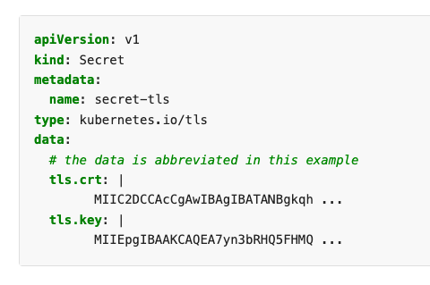

`k8s-2-gsm` is a containerized script that leverages the Google and Kubernetes API clients to migrate Kubernetes secrets to Google Secret Manager.

If migrating GKE secrets to Google Secret Manager, Workload Identity can be used to simplify the process/automation.

## Prerequisites

- A Kubernetes cluster
  - An active `kubectl` client or API access
- Google Project with billing enabled & owner access
- [GoLang](https://go.dev/dl/) (if testing local)

If not enabled, enable the following GCP APIs:

```shell
gcloud services enable container.googleapis.com
gcloud services enable secretmanager.googleapis.com
```

> TODO: add picture (IAM/bindings in GCP vs. GKE/K8S to k/v maps)

## Known limitations

- Google Secret Manager is a key/value store, meaning only one secret per object.
  - Example: If you had 1 Kubernetes secret with 2 objects (tls.crt / tls.key), you now need 2 Google Secret Manager secrets (and 2 references / mounts in yaml).

    

    > I need to double-check how the CSI driver spec handles this.

- The values/file [payload size must be no larger than 64 KiB](https://cloud.google.com/secret-manager/quotas#content_limits)
  - Kubernetes secret [size limit is 1MiB](https://kubernetes.io/docs/concepts/configuration/secret/#restriction-data-size)

## Quickstart using Go

The application attempts to act as a script and is a single file (main.go). Here's how to run it outside of a cluster.

### 1) Setup CLI authentication

```shell
# refresh GCP creds. This is the account / ADC used for managing secrets
gcloud auth application-default login --no-launch-browser --quiet

# the future is here, give up in-tree plugins
export USE_GKE_GCLOUD_AUTH_PLUGIN=True

# get a valid kubeconfig or set KUBECONFIG="${HOME}/.kube/config"
gcloud container clusters get-credentials ${GKE_NAME}

# the auth plugin might need to be installed
gcloud components install gke-gcloud-auth-plugin
```

### 2) Set variables

```shell
# to read secrets from
export NAMESPACE="testing"
# to migrate secrets to
export PROJECT_ID="$(gcloud config list --format 'value(core.project)' 2>/dev/null)"
```

### 3) Run the script

```shell
# clone the repo
git clone git@github.com:jimangel/k8s-2-gsm.git && cd ./k8s-2-gsm

# create / copy k8s secrets to project gsm (implied default namespace)
# optionally pass `--exclude="secret-name1,secret-name2,secret-name3"`
go run . --project=${PROJECT_ID} --namespace=${NAMESPACE}
```

## Running the script on GKE using Workload Identity

If running in a GKE cluster, Workload Identity provides credentials to write Google secrets. 

### Pre-Reqs

In addition to the above pre-reqs, ensure the following is met:

- GCP
  - [Workload Identity enabled](https://cloud.google.com/kubernetes-engine/docs/how-to/workload-identity#enable)
  - A GCP service account to create secrets `gcloud iam service-accounts create ${SA_NAME} --project=${PROJECT_ID}`
    - (does not need to match anything in k8s or GCP)
  - IAM to create secrets as SA (`gcloud projects add-iam-policy-binding ${PROJECT_ID} --member "serviceAccount:${SA_NAME}@${PROJECT_ID}.iam.gserviceaccount.com" --role "roles/secretmanager.admin"`)
  - IAM to use Workload Identity as SA in specific K8S_NAMESPACE (`gcloud iam service-accounts add-iam-policy-binding ${SA_NAME}@${PROJECT_ID}.iam.gserviceaccount.com  --role roles/iam.workloadIdentityUser --member "serviceAccount:${PROJECT_ID}.svc.id.goog[${K8S_NAMESPACE}/${K8S_SERVICEACCOUNT}]"`)
- K8S
  - A Kubernetes service account to read secret data (`kubectl -n ${K8S_NAMESPACE} create serviceaccount ${K8S_SERVICEACCOUNT}`)
    - Annotate the K8s service account with GCP annotation (`kubectl annotate serviceaccount ${K8S_SERVICEACCOUNT} --namespace ${K8S_NAMESPACE} iam.gke.io/gcp-service-account=${SA_NAME}@${PROJECT_ID}.iam.gserviceaccount.com`)

### Setup Kubernetes Workload Identity secret reading permissions

The following allows us to grant the `${K8S_SERVICEACCOUNT}` the ability to view secrets via Workload Identity:

```shell
# create cluster role allowing to read secrets
kubectl create clusterrole secret-reader --verb=get,list,watch --resource=secrets

# bind the cluster role to our Workload Identity service account
kubectl -n ${K8S_NAMESPACE} create rolebinding read-secrets-${K8S_NAMESPACE} --clusterrole=secret-reader --serviceaccount=${K8S_NAMESPACE}:${K8S_SERVICEACCOUNT}
```

### Run the job

```shell
export FULL_IMAGE_PATH_W_TAG="us-central1-docker.pkg.dev/jimangel/public-repo/secret-migration:1.0.0-alpha"

# TODO
# kubectl create job --image=${FULL_IMAGE_PATH_W_TAG} secret-migration -- "/ko-app/app --project gke-gsm-migration-sandbox"
# kubectl run test --image=${FULL_IMAGE_PATH_W_TAG} --restart=Never -it --rm -- /ko-app/demo
# kubectl create job my-job --image=busybox -- date
```

Debug by getting the logs:

```shell
# careful if you have lots of jobs
kubectl -n ${K8S_NAMESPACE} logs job/$(kubectl -n ${K8S_NAMESPACE} get job -o=jsonpath="{.items[*]['metadata.name']}")
```

### Job clean up

The following cleans up Kubernetes compelete job list

```shell
kubectl delete -n ${K8S_NAMESPACE} job $(kubectl -n ${K8S_NAMESPACE} get job -o=jsonpath="{.items[*]['metadata.name']}")
```

### Troubleshooting

> failed to define/gather list secret names: secrets is forbidden: User "system:serviceaccount:default:secret-grabber" cannot list resource "secrets" in API group "" in the namespace "default"

First, check that the service account is the correct one. Then ensure there is some form of RBAC binding allowing GET/WATCH/LIST on the objects. See [Checking API Access](https://kubernetes.io/docs/reference/access-authn-authz/authorization/#checking-api-access):

```shell
# grep for secrets: `| grep secrets` and look for [get watch list]
kubectl auth can-i --list --namespace ${NAMESPACE} --as system:serviceaccount:${NAMESPACE}:${K8S_SERVICEACCOUNT}
```

### Other

```shell
# check image size (~47MB at time of writing)
docker pull ${FULL_IMAGE_PATH_W_TAG} && docker images ${FULL_IMAGE_PATH_W_TAG} --format='{{.Size}}'

# other debuging
# kubectl -n ${K8S_NAMESPACE} describe pod my-secret-pod
# kubectl -n ${K8S_NAMESPACE} get pod my-secret-pod -o yaml
# kubectl get events --sort-by='.lastTimestamp' -n ${K8S_NAMESPACE}
```

## TODO:

- test multiple data migration types (TLS, data, files, etc)
- need to validate TLS validity after migration via keypair check
- output csv (create a map/struct and io dump)
- sample deployment YAML generation? (might be another tool)
- add namespace to labels and checks
- move README.md steps to make / script
- account for networking failure / retries?
- Include the ability to generate YAML to update deployments
- The k8s YAML could be a one-liner kubectl command if the API reference was looked up
- Check TODO in main.go
- double check example
- for the day-2-day use, maybe switch to "roles/secretmanager.secretAccessor"